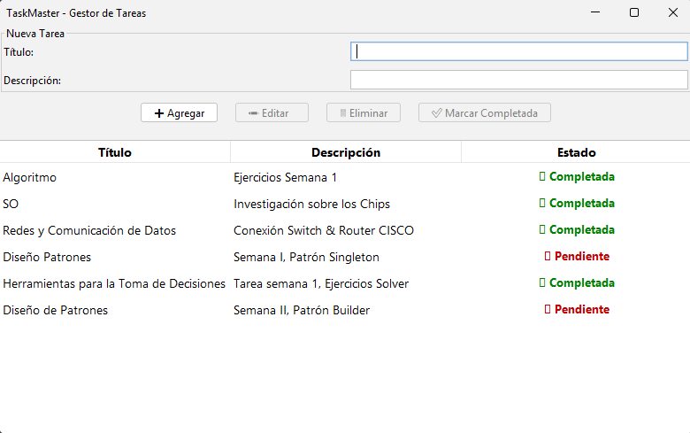

\# ✅ TaskMaster (Java Swing)


Una aplicación de escritorio desarrollada en Java Swing para gestionar tareas pendientes. Posee una interfaz moderna, organizada y funcional que permite crear, editar, eliminar y marcar tareas como completadas.

---

\## 🚀 Funcionalidades

\- ✅ Crear nuevas tareas con título y descripción
\- ✅ Editar tareas seleccionadas
\- ✅ Eliminar tareas registradas
\- ✅ Marcar tareas como completadas
\- ✅ Guardar y cargar tareas automáticamente en archivo `.json`
\- ✅ Interfaz moderna con estado visual diferenciado (pendiente o completado)
\- ✅ Uso de iconos, colores y diseño claro con soporte de `FlatLaf`

---

\## 🛠️ Tecnologías utilizadas

\- Java 21 o superior
\- Java Swing (GUI)
\- Gson (persistencia en archivo JSON)
\- FlatLaf (para interfaz moderna)
\- IDE sugerido: IntelliJ IDEA

---

\## 📂 Estructura del proyecto

taskmaster/

├── src/
│ ├── Main.java
│ ├── modelo/
│ │ └── Tarea.java
│ ├── logica/
│ │ └── GestorTareas.java
│ └── interfaz/
│ └── VentanaPrincipal.java
├── libs/
│ ├── gson-2.10.1.jar
│ └── flatlaf-3.2.jar
├── data/
│ └── tareas.json
├── screenshot.png
├── README.md
└── LICENSE
---

\## ▶️ Cómo compilar y ejecutar

\### Opción 1: Desde terminal (Java 21+)

```bash

javac -cp "libs/gson-2.10.1.jar;libs/flatlaf-3.2.jar" -d out src/\*\*/\*.java
java -cp "out;libs/gson-2.10.1.jar;libs/flatlaf-3.2.jar" Main

En Linux/macOS reemplaza ; por : en el classpath.


Opción 2: Desde IntelliJ IDEA

&nbsp;   Abre el proyecto
&nbsp;   Ve a File > Project Structure > Libraries
&nbsp;   Agrega gson-2.10.1.jar y flatlaf-3.2.jar desde la carpeta libs/
&nbsp;   Ejecuta el archivo Main.java


💡 Captura de pantalla

La siguiente imagen muestra la interfaz gráfica de TaskMaster en ejecución:



---


## 👨‍💻 Autor

**Lino Chamorro**  
Desktop & Web Apps Developer  
[GitHub - linochamorro](https://github.com/linochamorro)

---

## 📄 Licencia

Este proyecto está bajo la licencia MIT.  
Consulta el archivo [LICENSE](LICENSE) para más detalles.